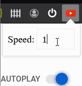

# ADHD YouTube for Firefox/Chrome

## What it does ##
Enables custom YouTube speeds (above 200%) for ADHDcels when the maximum YouTube player speed is simply not cutting it for your quality content and time management needs.

## Demo

## Installation
Download the [latest release](https://github.com/progcel/adhd-youtube/releases) and unzip in accordance to the browser you have.

**Chrome**: Settings -> Extensions -> Load unpacked -> Load the folder you just unzipped.

**Firefox**: Enter "about:debugging#/runtime/this-firefox" in the URL bar -> Click "Load Temporary Add-on..." -> Select manifest.json in the folder you just unzipped.